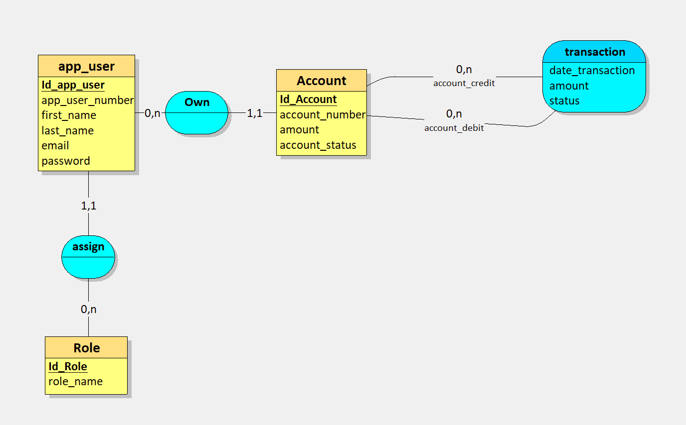
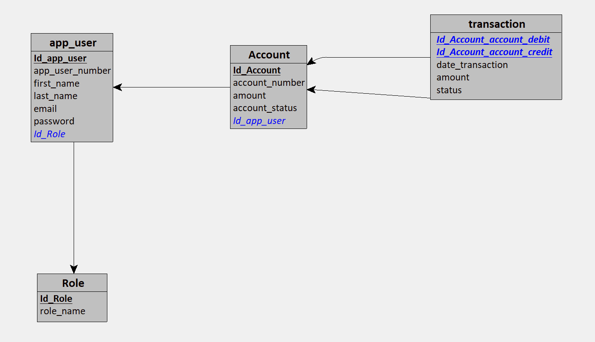
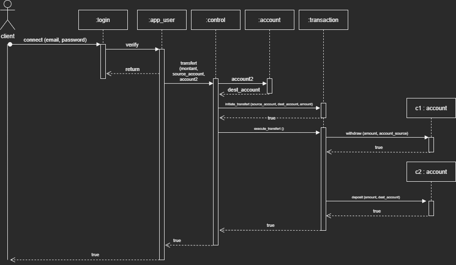
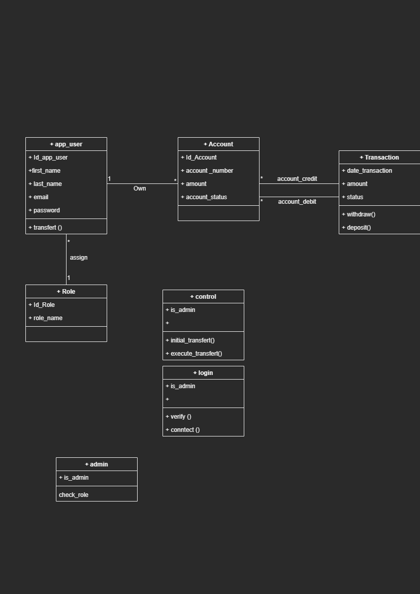

### Streaking-Samurai
Bank Root brief Julie, Nico, Radouan, Kevin, Eric

## Table des matières
1. [Contraintes de gestion](#Contraintes-de-gestion)
2. [Livrables](#Livrables)  
   2.1. [MCD](#MCD)  
   2.2. [MLD](#MLD)  
   2.3. [Diagramme Use-case](#USE-CASES)  
   2.4. [Diagramme de séquence](#SEQUENCE-DIAGRAM)   
   2.5. [Diagramme de classe](#CLASS-DIAGRAM)
3. [Technologies utilisées](#Technologies-utilisées)  

-----------------------------  
  
# **MVP : Bank Root**  
  
-----------------------------

## **Présentation du projet**  

Simulation de projet client, le client étant une banque, cherchant à renouveler son système informatique de gestion de comptes client.

## **Contraintes de gestion**  

	Le système inclura une API fonctionnelle.
	Les numéros de compte sont uniques, chaque client peut avoir plusieurs comptes.
	Les comptes peuvent être débiteurs ou créditeurs.
	Possibilité de transaction de compte à compte (débit/crédit)
	Possibilité d’avoir un « espace personnel » avec : le listing des comptes du client.
	Possibilité d’afficher les détails de chaque compte, avec un historique des transactions
	Le client peut via des formulaires effectuer des dépôts ou des retraits d’argent.
	L’utilisateur peut également choisir de supprimer chaque compte, sous réserve de validation   
    par l’admin

## **Rôles des utilisateurs**  

	User, Admin  

## **Livrables**  

#### **Dictionnaire de données**

| NOM                | DESIGNATION               | Type         |
| ------------------ | ------------------------- | ------------ |
| client_number      | Numéro du client          | VARCHAR(150) |
| client_password    | Mot de passe client       | VARCHAR(150) |
| first_name         | Nom client                | VARCHAR(75)  |
| last_name          | Prenom client             | VARCHAR(75)  |
| email              | Email Client              | VARCHAR(150) |
| is_admin           | Status admin              | Booleen      |
| account_number     | Numero du compte          | INT          |
| account_amount     | Solde du compte           | DECIMAL      |
| account_status     | Etat du compte            | Booleen      |
| transaction_date   | Date de transaction       | DATETIME     |
| transaction_amount | Montant de la transaction | DECIMAL      |
| transaction_status | Etat de la transaction    | VARCHAR(50)  |     |

#### **MCD**
   
#### **MLD**  

#### **USE CASES**  

#### **SEQUENCE DIAGRAM**
  
#### **CLASS DIAGRAM**  

#### Plan de sécurisation (fourni à côté)  (lien cliquable)

## **Technologies utilisées**  

	Environnement : ASP.NET  
	Base de donnée : PostreSQL  
	ORM : Entity framework  
	Interpreteur front : Razor  
	Langages : c#, html, javascript, css, (cshtml), SQL (postgre flavor)   

	qsf
	2
	3